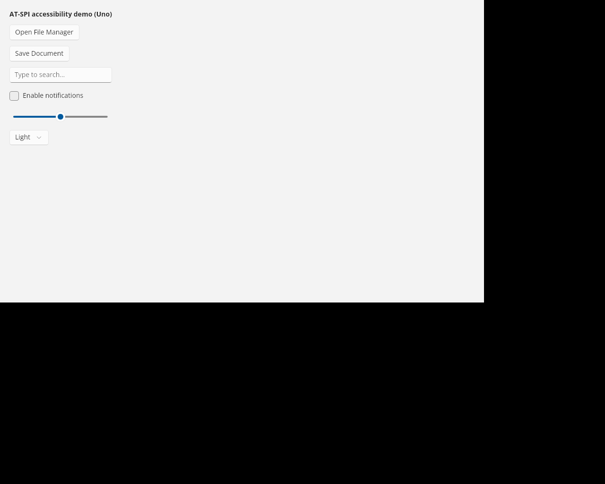

# uno-atspi-bridge

**A proof-of-concept AT-SPI accessibility backend for Uno Platform on Linux —
written in application code, verified headless in a container.**

Uno's Skia desktop head renders to X11 but publishes **no** AT-SPI tree, so on
Linux a Uno app is invisible to screen readers (Orca) and to
[AT-SPI-first agents](https://jocheojeda.com/2026/08/22/at-spi-first-grounding/).
This repo builds the missing backend: it walks Uno's `AutomationPeer` tree and
serves it over the accessibility D-Bus, including **live focus / state events**.

Full write-up: [I Gave Uno Platform a Linux Accessibility Backend in an Afternoon](https://jocheojeda.com/2026/08/23/uno-linux-accessibility-backend/).



*The demo app whose controls the bridge exposes.*

> **Windows needs none of this — on the WinAppSDK head.** The same app built with
> its native Windows head (WinAppSDK) exposes full UI Automation out of the box — an
> agent drives every control natively, no bridge. Validated with Telekinesis on real
> hardware: [results/windows-uia-native.md](results/windows-uia-native.md). But note:
> Uno 6.x's default template ships the single **Skia desktop** head, and a *Windows*
> app on that head has the same canvas gap this repo bridges on Linux — "Windows is
> fine" only holds when you build the WinAppSDK head.

## The gap is a canvas problem, not an Uno problem

Any toolkit that paints its own pixels (Skia, canvas) publishes no control-level
accessibility unless someone bridges its peer tree to the platform API. First-hand
data across two toolkits:

| Toolkit / head | Windows | Linux | macOS |
|---|---|---|---|
| **Uno — Skia desktop (default)** | gap → needs a bridge | gap → **this bridge** | gap (untested, see [#5](https://github.com/egarim/uno-atspi-bridge/issues/5)) |
| **Uno — WinAppSDK head** | native UIA ✅ | n/a | n/a |
| **Avalonia (stock template)** | native UIA ✅ | native AT-SPI ✅ (12.0+, `Avalonia.FreeDesktop.AtSpi`; 11.x has the gap) | native AXAPI ✅ |

The AT-SPI-first *consumer* of all this is
[**Telekinesis**](https://github.com/egarim/telekinesis) — an MCP server that lets
agents see and drive desktops through the platform a11y APIs (UIA / AT-SPI / AXAPI),
now on NuGet: `dotnet tool install -g Telekinesis`.

## What works

| capability | status |
|---|---|
| App registers on the AT-SPI desktop (`Socket.Embed`) | ✅ |
| Per-control `Accessible` (role, name, states, children) | ✅ |
| `Component` (bounding box, position, size) | ✅ |
| **Live events** — `state-changed:focused/checked/expanded`, `PropertyChange`, `SelectionChanged` | ✅ |
| **`Action`** — press / toggle / expand / select through the bus | ✅ |
| **`Value`** — slider read + clamped write (`CurrentValue`) | ✅ |
| **`EditableText` + `Text`** — type into entries, read text back | ✅ |
| **`Selection`** — combo items enumerable + selectable | ✅ |
| Screen-space coordinates (window origin applied) | ✅ (see note) |

## Quick start (Docker — no Linux desktop needed)

Prereqs: Docker. Everything else (the .NET SDK, Xvfb, D-Bus, `at-spi2-core`,
the Python `Atspi` client) is inside the image.

```bash
git clone https://github.com/egarim/uno-atspi-bridge
cd uno-atspi-bridge

# build the image (Uno app + headless AT-SPI harness)
docker build -f harness/Dockerfile \
  --build-arg APP_DIR=UnoApp \
  --build-arg APP_PROJ=app/UnoDemo/UnoDemo.csproj \
  --build-arg APP_TFM=net10.0-desktop \
  -t uno-atspi-poc .
```

**1. Dump the AT-SPI tree** (what a screen reader / agent reads):

```bash
docker run --rm -v "$PWD/harness:/harness" uno-atspi-poc /app/UnoDemo.dll ""
```
Expected: `1 application registered: 'UnoDemo'` followed by `[push button] 'Open
File Manager' box=(...)`, `[entry] 'Search box'`, `[check box] ...`, etc.

**2. Live events + screenshot** — the app drives a focus change and a checkbox
toggle; a listener (like Orca) catches the events:

```bash
mkdir -p results
docker run --rm -v "$PWD/results:/out" -v "$PWD/harness:/harness" \
  --entrypoint bash uno-atspi-poc /harness/run_events.sh /app/UnoDemo.dll
```
Expected — a screenshot at `results/app-screenshot.png` and:
```
[EVENT] object:state-changed:focused  value=1  source=[entry] 'Search box'
[EVENT] object:state-changed:checked  value=1  source=[check box] 'Enable notifications'
```

## Captured results

- [`results/step2-uno-atspi-via-bridge.txt`](results/step2-uno-atspi-via-bridge.txt) — the full tree
- [`results/step3-live-events.txt`](results/step3-live-events.txt) — the live events
- [`results/app-screenshot.png`](results/app-screenshot.png) — the rendered app

## How it works

[`UnoApp/UnoDemo/Atspi/AtspiBridge.cs`](UnoApp/UnoDemo/Atspi/AtspiBridge.cs), on
`Tmds.DBus.Protocol`:

1. **Discover + connect** — ask the session bus for the a11y bus
   (`org.a11y.Bus.GetAddress`) and connect to it.
2. **Walk the peers** — `FrameworkElementAutomationPeer.CreatePeerForElement`
   over the visual tree → a flat list of nodes with role, name, box, states.
3. **Screen coordinates** — read the window origin from `AppWindow.Position` and
   add it to any window-relative rects.
4. **Embed** — `org.a11y.atspi.Socket.Embed` attaches the app root to the desktop.
5. **Serve** — a D-Bus object per node implementing `org.a11y.atspi.Accessible`
   + `Component` (+ `Application` on the root).
6. **Emit events** — hook `GotFocus`/`LostFocus` and `ToggleButton.Checked/Unchecked`,
   emit `org.a11y.atspi.Event.Object.StateChanged` signals (`siiv(so)`).

Role mapping (`AutomationControlType` → real `AtspiRole` id/name): Button→push
button, Edit→entry, CheckBox→check box, Slider→slider, ComboBox→combo box,
Text→label. **Note:** `libatspi` derives the role name from the numeric role id,
not from `GetRoleName` — the ids must be the real enum values.

## Run on a real Linux desktop (no container)

On a Linux box with a D-Bus session + AT-SPI running (GNOME/most desktops):

```bash
cd UnoApp/UnoDemo
dotnet run -f net10.0-desktop
# then, in another terminal, inspect with accerciser, or run Orca
```
The bridge auto-starts (`AtspiBridge.TryStart` in `MainPage`) when an a11y bus is
present. On a real desktop the window origin is non-zero, so the screen
coordinates are true screen space.

## Scope / honesty (it's a PoC)

Done: the read path + focus/checked events. **Not** done: the `Text`/`Value`/
`Action` interfaces (reading a caret, invoking through AT-SPI), `children-changed`
events, filtering of non-actionable internals (scrollbar repeat-buttons appear),
and richer state coverage. In the headless container the window sits at `(0,0)`,
so screen and window coordinates coincide — the origin logic is exercised on a
real desktop.

The right long-term home is **[Uno's own accessibility abstraction](https://platform.uno/docs/articles/features/working-with-accessibility.html)**
— 6.6 already routes peers to Windows / macOS / WebAssembly backends, so this is
really a demonstration that the Linux AT-SPI backend slotting into that
abstraction is a bounded, contributable piece of work.

## Layout

```
UnoApp/                     the Uno desktop app + Atspi/AtspiBridge.cs
harness/Dockerfile          .NET SDK + Xvfb + dbus + at-spi2 + Python Atspi + scrot
harness/run.sh              start registry + app, dump the tree
harness/run_events.sh       + drive focus/toggle, capture events + screenshot
harness/atspi_dump.py       AT-SPI client: walk + print the tree (like Orca)
harness/atspi_listen.py     AT-SPI client: print live state-changed events
results/                    captured tree, events, screenshot
```

## License

MIT.
