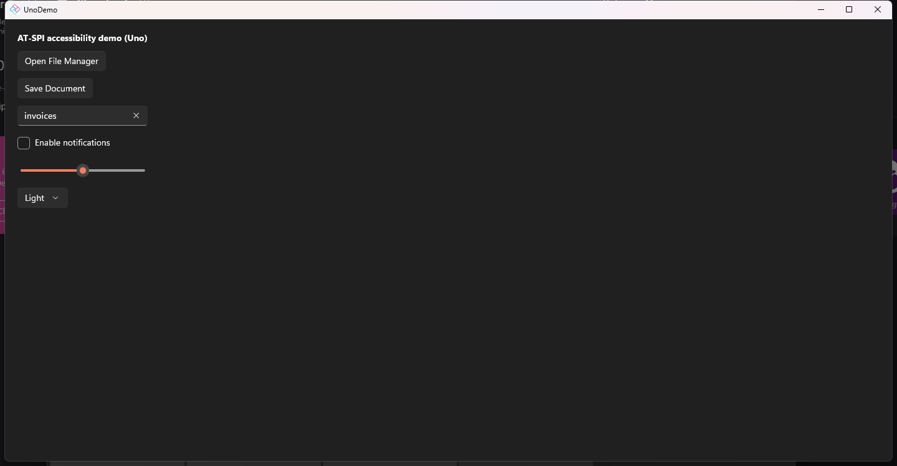

# Windows: Uno + Telekinesis via native UIA — no bridge needed

Validated 2026-08-26 on a Surface Laptop 7 (Windows 11 ARM64, .NET SDK 10.0.400).

The AT-SPI bridge in this repo exists because Uno's **Skia heads** (Linux) render to a
canvas that exposes no control-level accessibility. On Windows the story is the opposite:
UnoDemo's **native Windows head (WinAppSDK / WinUI 3)** renders real native controls with
full **UI Automation** exposure, so [Telekinesis](https://github.com/egarim/telekinesis)'s
Windows UIA backend sees and drives the app directly — the bridge is neither used nor
compiled into the run path (`AtspiBridge.TryStart` is guarded with `#if !WINDOWS`).

## What was changed
- `UnoDemo.csproj`: added `net10.0-windows10.0.19041.0` to `<TargetFrameworks>` (the
  WinAppSDK head). Uno.Sdk 6.6.42 accepted it cleanly — no fresh `dotnet new unoapp` needed.
- `MainPage.xaml.cs`: wrapped `AtspiBridge.TryStart(this)` in `#if !WINDOWS`.

Build & run:

```
dotnet build UnoDemo/UnoDemo.csproj -f net10.0-windows10.0.19041.0
dotnet run --project UnoDemo -f net10.0-windows10.0.19041.0
```

## What Telekinesis saw and did (all verified)

`telekinesis probe --app pid:<UnoDemo>` shows every named control as a real UIA element
(full tree in [windows-uia-tree.txt](windows-uia-tree.txt)):

```
[Button]   "Open File Manager"
[Button]   "Save Document"
[Edit]     "Search box"
[CheckBox] "Enable notifications"
[Slider]   "Volume"
[ComboBox] "Theme selector"
```

Actions, all via the **native pattern path** (no input injection):

- `--click "Save Document"` → `success=True path=NativeAction` (UIA InvokePattern)
- `--find "Search box" --set-text "invoices"` → `success=True path=NativeAction`
  (ValuePattern), read back through UIA: `text="invoices"` — **VERIFIED**

Screenshot of the app after the run (search box filled by Telekinesis):


## Takeaway

| Platform | Uno head | A11y exposure | Bridge needed |
|---|---|---|---|
| Windows | WinAppSDK (native) | Full UI Automation | **No** |
| Linux | Skia canvas | None from the canvas | Yes — this repo's AT-SPI bridge, plus the SkiaSharp/FreeType fix |
